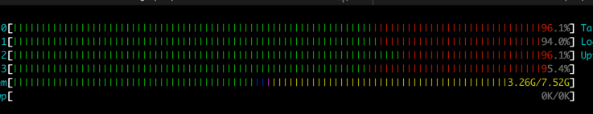
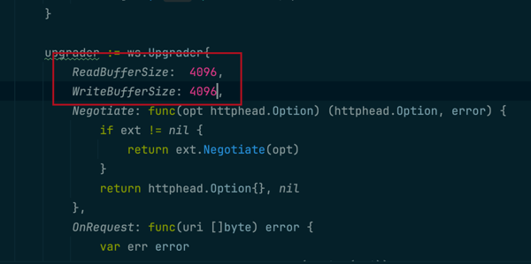

# 性能测试

## 背景说明

### 机器选择
服务端：4核8g 实际能使用的内存在6g 第三方依赖 占了2g

客户端：4核8g


### 启动说明
服务端相关内容启动
1. 切换工作目录 demo/ws
2. 启动第三方依赖 make e2e_up
3. 启动mock后端服务  make mock_backend
4. 启动ws网关 make run_gateway_only


客户端相关内容准备
1. 工作目录还是 demo/ws
2. 运行客户端压测脚本 go run client/example/main.go 
3. 相关参数可以查看 demo/ws/client/example/usage.md


## 测试目的
了解websocket服务器的如下指标
1. 最大并发连接数
2. 单位时间消息吞吐量（TPS）在这个项目里，事务里就是客户端发一条数据 ws返回ack，然后客户端返回ack。
3. 系统资源占用（CPU、内存、IO）


## 压测时的变量
1. github.com/gobwas/ws包的一些参数
2. 系统的tcp相关参数
3. 系统的websocket相关参数
4. 并发连接数
5. 消息大小
6. 消息频率

## 压测记录
cd demo/ws/client/example
### 修改并发连接数 每秒一条数据，一条数据100B 4000条接近极限
```shell
go run main.go -clients=4000  -mps=1 -duration=40s
2025/06/28 15:07:46 === 统计信息 ===
2025/06/28 15:07:46 总连接数: 4000
2025/06/28 15:07:46 总消息数: 138805
2025/06/28 15:07:46 成功消息数: 135172
2025/06/28 15:07:46 失败消息数: 3633
2025/06/28 15:07:46 运行时间: 40.45230658s
2025/06/28 15:07:46 消息速率: 3431.32 msg/s
2025/06/28 15:07:46 成功率: 97.38%
2025/06/28 15:07:46 ================
```

分析：有3000多条消息超时，cpu基本被耗尽。

### 并发连接还是4000个修改每秒发送的数据量。每秒发两个接近极限
```
go run main.go -clients=4000  -mps=2 -duration=40s
2025/06/28 15:14:22 === 统计信息 ===
2025/06/28 15:14:22 总连接数: 4000
2025/06/28 15:14:22 总消息数: 177438
2025/06/28 15:14:22 成功消息数: 160194
2025/06/28 15:14:22 失败消息数: 17244
2025/06/28 15:14:22 运行时间: 41.729318917s
2025/06/28 15:14:22 消息速率: 4252.12 msg/s
2025/06/28 15:14:22 成功率: 90.28%
2025/06/28 15:14:22 ================
```
解析: 吞吐量大概在4200/s

### 提高到3/s
```shell
2025/06/28 15:19:55 === 统计信息 ===
2025/06/28 15:19:55 总连接数: 3999
2025/06/28 15:19:55 总消息数: 179566
2025/06/28 15:19:55 成功消息数: 169918
2025/06/28 15:19:55 失败消息数: 9648
2025/06/28 15:19:55 运行时间: 41.077239377s
2025/06/28 15:19:55 消息速率: 4371.42 msg/s
2025/06/28 15:19:55 成功率: 94.63%
2025/06/28 15:19:55 ================
```
解析吞吐量不再增加。消息处理较慢


### 提高消息大小 
消息量为500字节
```shell 
 go run main.go -clients=4000  -mps=2   -msg-size=500 -duration=40s
2025/06/29 15:34:51 === 统计信息 ===
2025/06/29 15:34:51 总连接数: 4000
2025/06/29 15:34:51 总消息数: 156417
2025/06/29 15:34:51 成功消息数: 145619
2025/06/29 15:34:51 失败消息数: 10798
2025/06/29 15:34:51 运行时间: 41.138868448s
2025/06/29 15:34:51 消息速率: 3802.17 msg/s
2025/06/29 15:34:51 成功率: 93.10%
2025/06/29 15:34:51 ================
```
消息量为1000字节

```shell
2025/06/29 15:40:06 正在停止所有客户端...
2025/06/29 15:40:07 === 统计信息 ===
2025/06/29 15:40:07 总连接数: 4000
2025/06/29 15:40:07 总消息数: 149169
2025/06/29 15:40:07 成功消息数: 136201
2025/06/29 15:40:07 失败消息数: 12968
2025/06/29 15:40:07 运行时间: 41.327402361s
2025/06/29 15:40:07 消息速率: 3609.45 msg/s
2025/06/29 15:40:07 成功率: 91.31%
2025/06/29 15:40:07 ================
```

消息为5000字节
```shell
2025/06/29 15:44:04 === 统计信息 ===
2025/06/29 15:44:04 总连接数: 4000
2025/06/29 15:44:04 总消息数: 116062
2025/06/29 15:44:04 成功消息数: 101746
2025/06/29 15:44:04 失败消息数: 14316
2025/06/29 15:44:04 运行时间: 41.511521048s
2025/06/29 15:44:04 消息速率: 2795.90 msg/s
2025/06/29 15:44:04 成功率: 87.67%
2025/06/29 15:44:04 ================
```
消息大小也会影响吞吐量

## 调整linux的websocket参数

参数
```shell
# 调整 socket 缓冲区
net.core.wmem_default
net.core.rmem_default 
net.core.rmem_max
net.core.wmem_max


查看之前的
net.core.rmem_default = 212992
net.core.wmem_max = 212992

临时修改
sudo sysctl -w net.core.rmem_default=4194304  # 设置为4MB
sudo sysctl -w net.core.wmem_default=1048576  # 设置为1MB
sudo sysctl -w net.core.rmem_max=16777216     # 最大16MB
sudo sysctl -w net.core.wmem_max=16777216

2025/06/30 09:47:44 === 统计信息 ===
2025/06/30 09:47:44 总连接数: 4000
2025/06/30 09:47:44 总消息数: 164572
2025/06/30 09:47:44 成功消息数: 151506
2025/06/30 09:47:44 失败消息数: 13066
2025/06/30 09:47:44 运行时间: 41.27909792s
2025/06/30 09:47:44 消息速率: 3986.81 msg/s
2025/06/30 09:47:44 成功率: 92.06%
2025/06/30 09:47:44 ================  
分析统计：吞吐量没有明显变化
```

```shell
调整TCP层级的缓冲区自动调整范围（接收） 
sysctl -w net.ipv4.tcp_rmem="4096 87380 16777216"
TCP层级的缓冲区自动调整范围（发送）
sysctl -w net.ipv4.tcp_wmem="4096 65536 16777216"
2025/06/30 10:36:03 === 统计信息 ===
2025/06/30 10:36:03 总连接数: 4000
2025/06/30 10:36:03 总消息数: 159006
2025/06/30 10:36:03 成功消息数: 148438
2025/06/30 10:36:03 失败消息数: 10568
2025/06/30 10:36:03 运行时间: 41.101919371s
2025/06/30 10:36:03 消息速率: 3868.58 msg/s
2025/06/30 10:36:03 成功率: 93.35%
分析统计：吞吐量没有明显变化
```


```
调整TCP连接队列长度（提升accept backlog）
sysctl -w net.core.somaxconn=65535
sysctl -w net.ipv4.tcp_max_syn_backlog=8192
sysctl -w net.core.netdev_max_backlog=65536
2025/06/30 10:39:43 === 统计信息 ===
2025/06/30 10:39:43 总连接数: 4000
2025/06/30 10:39:43 总消息数: 161421
2025/06/30 10:39:43 成功消息数: 151261
2025/06/30 10:39:43 失败消息数: 10160
2025/06/30 10:39:43 运行时间: 41.095412599s
2025/06/30 10:39:43 消息速率: 3927.96 msg/s
2025/06/30 10:39:43 成功率: 93.71%
2025/06/30 10:39:43 ================
分析统计：吞吐量没有明显变化

调整somaxconn为4096
2025/06/30 11:28:05 === 统计信息 ===
2025/06/30 11:28:05 总连接数: 4000
2025/06/30 11:28:05 总消息数: 163478
2025/06/30 11:28:05 成功消息数: 152511
2025/06/30 11:28:05 失败消息数: 10967
2025/06/30 11:28:05 运行时间: 41.30410147s
2025/06/30 11:28:05 消息速率: 3957.91 msg/s
2025/06/30 11:28:05 成功率: 93.29%
2025/06/30 11:28:05 ================
基本不变
```


调整upgrader

1. 调整为4096
```shell
2025/06/30 10:47:32 === 统计信息 ===
2025/06/30 10:47:32 总连接数: 4000
2025/06/30 10:47:32 总消息数: 153385
2025/06/30 10:47:32 成功消息数: 141426
2025/06/30 10:47:32 失败消息数: 11959
2025/06/30 10:47:32 运行时间: 41.464406142s
2025/06/30 10:47:32 消息速率: 3699.20 msg/s
2025/06/30 10:47:32 成功率: 92.20%
2025/06/30 10:47:32 ================
没啥变化
```
2. 调整为8912
```shell
2025/06/30 10:52:44 === 统计信息 ===
2025/06/30 10:52:44 总连接数: 4000
2025/06/30 10:52:44 总消息数: 171118
2025/06/30 10:52:44 成功消息数: 162736
2025/06/30 10:52:44 失败消息数: 8382
2025/06/30 10:52:44 运行时间: 41.057690768s
2025/06/30 10:52:44 消息速率: 4167.75 msg/s
2025/06/30 10:52:44 成功率: 95.10%
2025/06/30 10:52:44 ================
吞吐量略有增加
```


