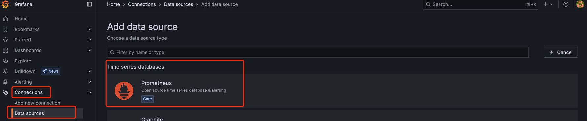
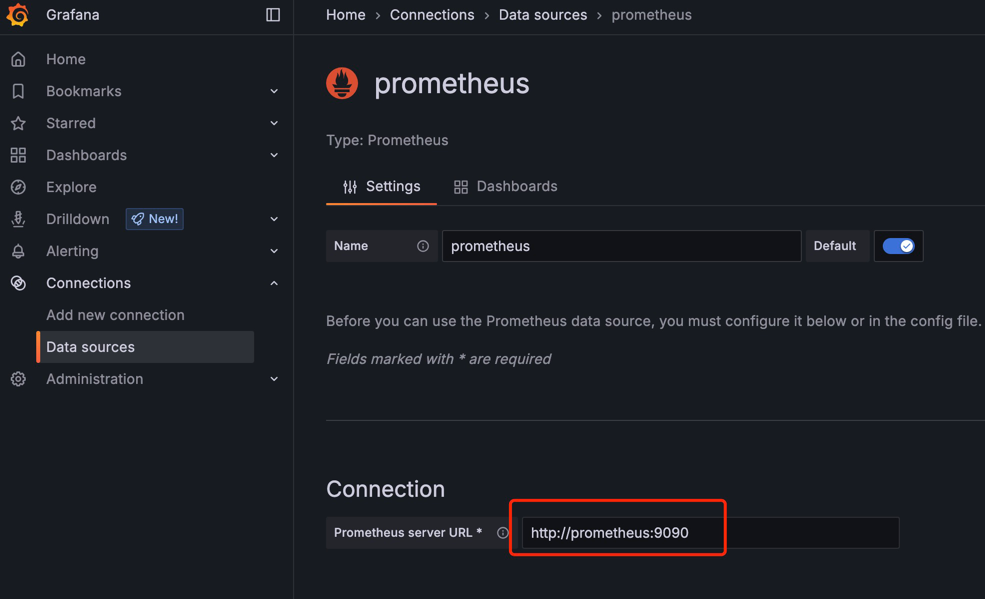

# WebSocket 网关启动指南

## 1. 项目简介

WebSocket 网关是一个基于Go语言开发的高性能WebSocket连接管理系统，使用了EGO框架构建。该项目主要用于处理大量WebSocket连接，提供消息路由、推送和管理功能，是极客时间WebSocket系列课程的配套项目。

项目特性：
- **高性能WebSocket连接管理**: 支持大量并发WebSocket连接
- **消息推送**: 基于Kafka的异步消息推送机制
- **会话管理**: 完善的用户会话和连接状态管理
- **服务发现**: 基于ETCD的服务注册与发现
- **缓存支持**: Redis缓存和本地缓存双重支持
- **监控治理**: 内置健康检查、指标监控等治理功能

## 2. 环境准备

### 2.1 安装Go环境

确保你的系统已安装Go 1.24.1或更高版本。

```bash
# 检查Go版本
go version
```

### 2.2 初始化项目环境

项目提供了便捷的环境初始化脚本，执行以下命令安装必要的工具：

```bash
make setup
```

此命令将安装以下工具：
- golangci-lint: 代码规范检查
- goimports: 导入包格式化
- mockgen: Mock代码生成
- wire: 依赖注入
- buf: Protobuf相关工具

同时会配置Git hooks来确保代码质量。

## 3. 配置项目

### 3.1 配置文件

项目的配置文件位于`config/config.yaml`，包含以下主要配置：

- **日志配置**: 日志级别和输出设置
- **Redis连接信息**: 缓存服务配置
- **Kafka配置**: 消息队列配置
- **ETCD配置**: 服务发现和配置中心
- **WebSocket服务器配置**: 监听地址和端口
- **后端服务配置**: 业务服务发现配置
- **推送消息配置**: 消息推送相关设置
- **重试策略配置**: 失败重试机制设置

根据你的环境修改相关配置：

```yaml
# 示例配置
redis:
  addr: "localhost:6379"

mq:
  kafka:
    network: "tcp"
    addr: "localhost:9092"

etcd:
  addrs:
    - "127.0.0.1:2379"
  connectTimeout: "1s"
  secure: false

server:
  websocket:
    host: "0.0.0.0"
    port: 9002
    serializer: "json"
```

### 3.2 启动依赖服务

项目依赖多个外部服务，可以通过Docker Compose快速启动这些服务：

```bash
# 启动测试环境所需的依赖服务
make e2e_up
```

这将启动以下服务：
- **Redis**: 缓存服务 (端口: 6379)
- **Kafka**: 消息队列服务 (端口: 9092/9094)
- **ETCD**: 服务发现和配置中心 (端口: 2379/2380)

注意：如果你使用Docker Desktop的Kubernetes功能，可能会遇到ETCD端口冲突，需要关闭Kubernetes功能或为ETCD更换端口。

## 4. 构建和运行

### 4.1 代码检查和测试

在启动服务前，推荐执行以下命令确保代码质量：

```bash
# 代码格式化
make fmt

# 依赖整理
make tidy

# 代码规范检查
make lint

# 单元测试
make ut

# 基准测试
make bench
```

### 4.2 启动网关服务

在项目根目录下可以通过以下命令启动WebSocket网关服务：

```bash
# 完整启动（包含依赖服务）
# 该命令会清空并重建docker compose，等待依赖服务启动后再运行网关
make run_gateway

# 仅启动网关（需要提前运行 make e2e_up）
make run_gateway_only
```

服务成功启动后，你将看到类似以下的输出信息：
- WebSocket服务监听在 `0.0.0.0:9002`
- 治理服务监听在 `0.0.0.0:9003`
- 各种服务组件初始化完成的日志

### 4.3 验证服务状态

服务启动后，可以通过以下方式验证服务是否正常运行：

1. **健康检查接口**: http://localhost:9003/health
2. **服务指标**: http://localhost:9003/metrics
3. **WebSocket连接测试**: 连接到 ws://localhost:9002

你也可以使用WebSocket客户端工具测试连接功能。

## 5. 开发指南

### 5.1 项目结构

```
├── api/           # API定义和Protobuf文件
│   └── proto/         # gRPC protobuf定义
├── cmd/           # 可执行程序入口
│   ├── main.go        # 主程序入口
│   ├── ioc/           # 依赖注入配置
│   └── logs/          # 日志文件目录
├── config/        # 配置文件
│   └── config.yaml    # 主配置文件
├── docs/          # 项目文档
├── internal/      # 内部代码包
│   ├── codec/         # 编解码器
│   ├── consts/        # 常量定义
│   ├── link/          # WebSocket连接封装
│   ├── linkevent/     # 连接事件处理
│   ├── upgrader/      # WebSocket升级器
│   ├── websocket_server.go  # WebSocket服务器实现
│   ├── container.go   # 依赖容器
│   └── config.go      # 配置结构
├── ioc/           # IOC配置
├── pkg/           # 公共包
│   ├── grpc/          # gRPC相关工具
│   ├── id/            # ID生成器
│   ├── jwt/           # JWT工具
│   └── session/       # 会话管理
├── scripts/       # 脚本文件
│   ├── test_docker_compose.yml  # 测试环境Docker配置
│   ├── setup.sh       # 环境初始化脚本
│   └── lint/          # 代码检查配置
└── types.go       # 全局类型定义
```

### 5.2 代码生成

项目使用了多种代码生成工具：

```bash
# 生成gRPC相关文件
make grpc

# 生成Go代码（wire、mock等）
make gen
```

### 5.3 核心组件说明

- **WebSocketServer**: 核心WebSocket服务器，处理连接管理和消息路由
- **Link**: WebSocket连接的封装，提供发送、接收、超时控制等功能
- **LinkEventHandler**: 连接事件处理器，处理连接建立、消息接收等事件
- **Upgrader**: WebSocket协议升级器，负责HTTP到WebSocket的协议升级
- **Session**: 会话管理，维护用户连接状态信息

## 6. 常见问题

### 6.1 连接问题

**Redis连接失败**
- 检查Redis服务是否正常运行：`docker ps | grep redis`
- 验证配置文件中的Redis地址是否正确
- 确认Redis端口6379是否可访问

**Kafka连接失败**
- 检查Kafka服务状态：`docker ps | grep kafka`
- 验证Kafka配置中的网络地址
- 确认Kafka端口9092/9094是否可访问

**ETCD连接失败**
- 检查ETCD服务状态：`docker ps | grep etcd`
- 验证ETCD配置中的地址列表
- 如遇端口冲突，检查是否与K8s等服务冲突

### 6.2 服务启动问题

**服务无法启动**
- 检查日志文件：`cmd/logs/` 目录下的日志文件
- 验证配置文件语法是否正确
- 确认所有依赖服务已正常启动
- 检查端口是否被占用：`lsof -i :9002` 和 `lsof -i :9003`

**WebSocket连接被拒绝**
- 验证WebSocket服务是否在正确端口监听
- 检查防火墙设置
- 确认客户端连接地址是否正确

### 6.3 性能问题

**连接数限制**
- 调整系统文件描述符限制：`ulimit -n`
- 检查Go的GOMAXPROCS设置
- 监控内存使用情况

**消息推送延迟**
- 检查Kafka消费者配置
- 监控网络延迟
- 调整缓冲区大小配置

## 7. 监控和运维

### 7.1 健康检查

```bash
# 检查服务健康状态
curl http://localhost:9003/health

# 查看服务指标
curl http://localhost:9003/metrics
```

### 7.2 日志管理

日志文件位于 `cmd/logs/` 目录，包含：
- 应用日志：记录业务逻辑和错误信息
- 访问日志：记录WebSocket连接和消息处理
- 系统日志：记录系统级别的运行信息

### 7.3 性能监控

服务提供Prometheus格式的指标，包括：
- WebSocket连接数
- 消息处理速率
- 错误率统计
- 系统资源使用情况

### 7.4 配置告警

1. 使用浏览器访问[http://localhost:3000/login](http://localhost:3000/login) 并使用admin/admin登录Grafana。 会提示你设置新密码点击左下角的`Skip`即可。
2. 直接访问[添加数据源地址](http://localhost:3000/connections/datasources/new) 添加一个新的 Prometheus 数据源。
3. URL 设置为 http://prometheus:9090，因为 Grafana 和 Prometheus 在同一个 Docker 网络中，可以直接通过服务名访问。下滑到页面最下方点击`save & test` 按钮 
4. 创建仪表盘和图表：创建一个新的 Dashboard，添加一个 Panel，使用你刚刚添加的 Prometheus 数据源。
Grafana 的告警配置相对比较复杂，但逻辑很清晰：

启动 Grafana：docker-compose up -d grafana
添加数据源：浏览器访问 http://localhost:3000，登录 Grafana (默认 admin/admin)。
编写 PromQL 查询：在 Panel 的查询编辑器中，输入以下 PromQL 来计算每个网关实例的总连接数：
promql
sum(websocket_gateway_online_users) by (instance)
这里的 instance 标签是 Prometheus 自动为你添加的，它代表了抓取目标的地址（例如 host.docker.internal:9002）。
创建告警规则：
在 Panel 的 Alert 标签页下，点击 Create alert rule。
设置条件 (Condition)：选择 WHEN last() OF A IS ABOVE 1000 (假设阈值是 1000)。这意味着当查询 A (你的 PromQL) 的最新值超过 1000 时，触发告警。
添加标签 (Labels)：这是极其重要的一步。你需要把触发告警的 instance 信息附加到告警上，这样 Webhook 才能知道是哪个节点出了问题。添加一个标签，例如：instance={{ $labels.instance }}。
配置通知渠道 (Contact Point)：
在左侧菜单的 Alerting -> Contact points 中，创建一个新的 Contact point。
选择类型为 Webhook。
URL：输入你的 Webhook 地址，例如 http://host.docker.internal:8001/webhook/v1 (假设你的 Webhook Server 监听在宿主机的 8001 端口)。
保存。
关联规则和通知：回到你的告警规则配置，在 Notifications 部分，选择你刚刚创建的 Webhook contact point。
现在，只要任何一个网关实例的总连接数超过 1000，Grafana 就会向 http://host.docker.internal:8001/webhook/v1 发送一个包含 { "labels": { "instance": "host.docker.internal:9002" } } 等信息的 POST 请求。

## 8. 附录

### 8.1 重要端口列表

| 服务 | 端口 | 描述 |
|-----|-----|-----|
| WebSocket服务 | 9002 | WebSocket连接端口 |
| 治理服务 | 9003 | 健康检查、指标等管理端口 |
| Redis | 6379 | 缓存服务端口 |
| Kafka | 9092/9094 | 消息队列端口 |
| ETCD | 2379/2380 | 服务发现端口 |

### 8.2 环境变量

| 变量名 | 描述 | 默认值 |
|-------|-----|-------|
| EGO_DEBUG | 开启调试模式 | false |
| CONFIG_FILE | 配置文件路径 | config/config.yaml |

### 8.3 相关项目

- [演示 websocket 网关功能的 IM](https://gitee.com/flycash/simple-im)：配套的即时通讯应用

### 8.4 技术栈

- **框架**: EGO (Go微服务框架)
- **WebSocket**: gobwas/ws (高性能WebSocket库)
- **消息队列**: Kafka
- **缓存**: Redis + 本地缓存
- **服务发现**: ETCD
- **依赖注入**: Google Wire
- **测试**: testify
- **监控**: Prometheus metrics
