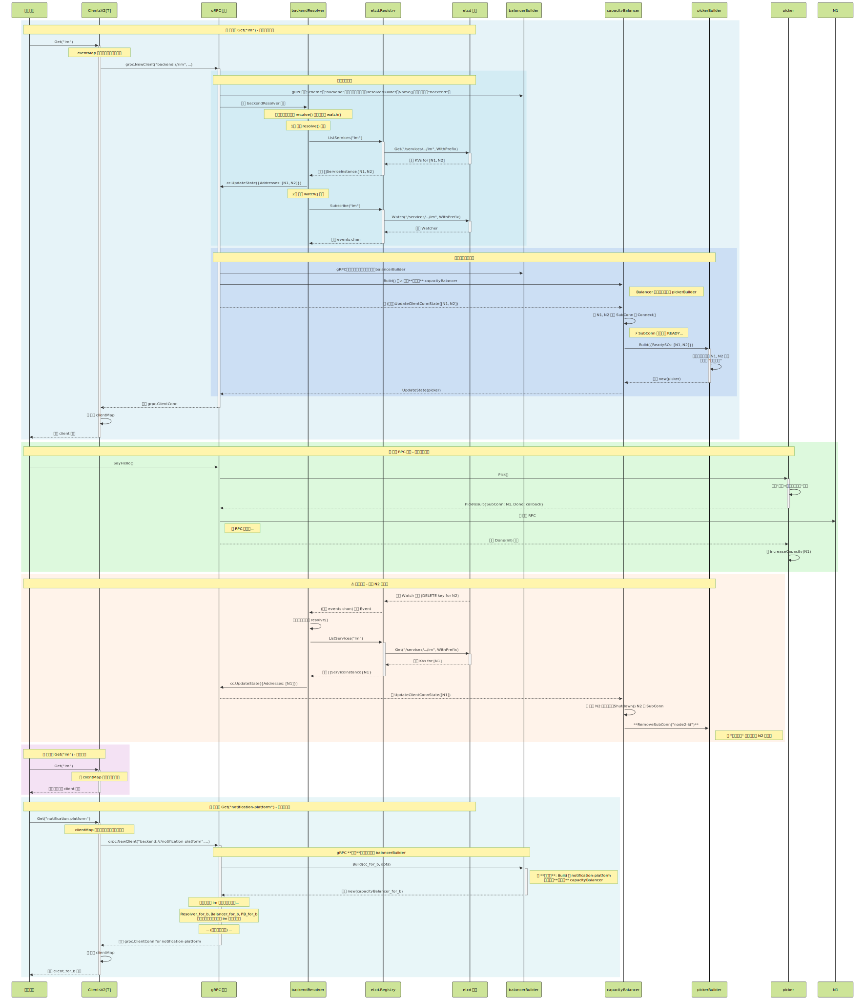
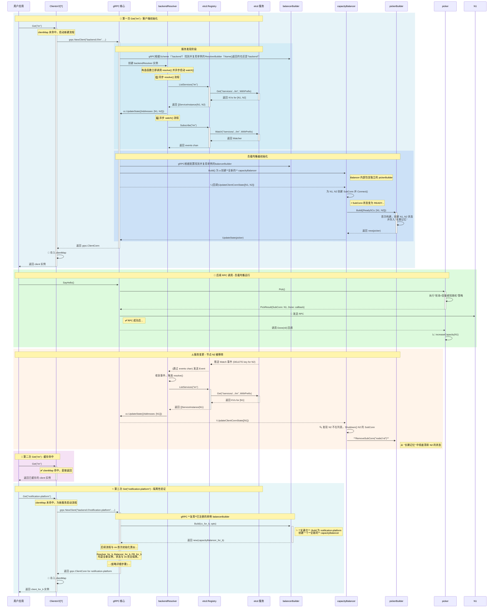

# gRPC 客户端负载均衡与服务发现

本文档阐述了 `pkg/grpc` 包下自定义 gRPC 服务发现和负载均衡的实现机制。

## 核心组件

-   **`ClientsV2`**: 客户端管理器，负责缓存和创建 gRPC 客户端。
-   **`resolver.go`**: 实现 gRPC 的 `resolver.Builder` 和 `resolver.Resolver` 接口。
    -   **`backendResolver`**: 负责从服务注册中心 (`Registry`) 拉取和监听服务实例地址，并上报给 gRPC 核心。
-   **`registry/etcd/registry.go`**: `Registry` 接口的 etcd 实现，负责与 etcd 交互，实现服务注册、注销、发现和监听。
-   **`balancer/capacity/v2`**: 自定义的"容量感知轮询"负载均衡策略。
    -   **`balancerBuilder`**: 负载均衡器的构造器。其核心职责是为**每个服务**创建一个独立的 `capacityBalancer` 实例，从根本上解决服务间状态污染的问题。
    -   **`capacityBalancer`**: `SubConn` (底层连接)的生命周期管理器。负责根据 `Resolver` 上报的地址列表，创建、更新或移除连接。它将所有与容量相关的状态管理委托给 `pickerBuilder`。
    -   **`pickerBuilder`**: 一个**有状态的 Picker 工厂**。它的核心是维护一个"长期记忆" `map`，用于持久化每个节点的容量信息，从而正确处理节点短暂离线后恢复的场景。
    -   **`picker`**: 无状态、一次性的连接选择器。在每次 RPC 调用时，执行"轮询+容量感知随机"策略来选择一个连接。

## 全链路协作时序图

## 全链路解析

### 第一次 `Get("im")` (客户端初始化)

这是最复杂的流程，涉及所有组件的首次初始化。

1.  **用户应用 -> ClientsV2 -> gRPC**: 用户请求 "im" 的客户端，因缓存未命中，`ClientsV2` 调用 `grpc.NewClient`。
2.  **服务发现**:
    *   gRPC 核心根据 `backend:///` scheme 找到并创建 `backendResolver` 实例。
    *   `Resolver` 立即执行 `resolve()`，通过 `Registry` 向 `etcd` 拉取 "im" 的全量地址 `[N1, N2]`，并上报给 gRPC。
    *   同时，`Resolver` 异步启动 `watch()`，通过 `Registry` 监听 `etcd` 中 "im" 的后续变更。
3.  **负载均衡器初始化**:
    *   gRPC 核心收到地址列表后，根据配置找到 `balancerBuilder`。
    *   `builder.Build()` 被调用，为 "im" 创建一个**全新的、独立的 `capacityBalancer`** 实例。
    *   `Balancer` 接收到地址列表 `[N1, N2]`，为它们创建 `SubConn`。
    *   当连接 `READY` 后，`Balancer` 调用其内部的 `pickerBuilder` 来构建一个 `picker`。`pickerBuilder` 会将 `[N1, N2]` 的初始容量状态存入其"长期记忆"中。
    *   最终，新创建的 `picker` 被上报给 gRPC，客户端初始化完成。

### 后续 RPC 调用

1.  用户应用发起 RPC 请求。
2.  gRPC 核心向当前活动的 `picker` 请求一个连接 (`Pick()`)。
3.  `picker` 执行"轮询+容量感知随机"策略选出一个连接，例如 `N1`。
4.  RPC 成功后，gRPC 调用 `picker` 返回的 `Done` 回调。
5.  在回调中，`picker` 调用 `increaseCapacity(N1)`，增加 `N1` 的当前容量，实现逐步放量。

### 服务变更 (节点被移除)

1.  `etcd` 中的节点 `N2` 被删除。
2.  `Resolver` 的 `watch()` 逻辑通过 `Registry` 监听到该 `DELETE` 事件。
3.  `Resolver` 重新执行 `resolve()`，从 `etcd` 拉取到只含 `[N1]` 的新列表，并上报给 gRPC。
4.  `Balancer` 收到新列表，对比后发现 `N2` 已不存在。
5.  **`Balancer` 履行其生命周期管理职责**: 关闭 `N2` 的 `SubConn`，并调用 `pickerBuilder.RemoveSubConn()` 来**彻底清理 `N2` 的持久化容量状态**。

### 第二次 `Get("im")` (缓存命中)

`ClientsV2` 直接从其内部 `clientMap` 中返回已创建好的客户端实例，无任何额外开销。

### 第三次 `Get("notification-platform")` (隔离性验证)

这是我们 `v2` 架构设计的核心价值所在，完美地展示了如何解决服务间状态污染的问题。

1.  **ClientsV2 -> gRPC**: 用户请求一个新服务 `notification-platform`，`clientMap` 未命中，再次调用 `grpc.NewClient`。
2.  **gRPC 核心 -> Builder**:
    *   gRPC 核心**复用**我们全局注册的那个单例 `balancerBuilder` 实例。
    *   它再次调用 `builder.Build()` 方法，但这次传入的是为 `notification-platform` 创建的 `ClientConn`。
3.  **Builder -> gRPC 核心 (关键步骤)**:
    *   `balancerBuilder` 的 `Build` 方法执行，它创建了一个**全新的、独立的 `capacityBalancer` 实例** (`balancer_for_b`)。
    *   这个新的 `balancer_for_b` 内部，也随之创建了一个**全新的、独立的 `pickerBuilder` 实例** (`pb_for_b`)。
4.  **隔离的状态**:
    *   接下来，为 `notification-platform` 创建的 `Resolver` 会将 `notification-platform` 的节点地址推送给 `balancer_for_b`。
    *   `balancer_for_b` 和 `pb_for_b` 会独立地管理 `notification-platform` 的连接和容量状态。
    *   **这一切都与 `im` 的 `balancer` 和 `pickerBuilder` 实例毫无关系**。它们存在于各自的内存空间中，状态完全隔离。

这一设计从根本上保证了不同服务之间的负载均衡是独立运作的，一个服务的节点变化（增加、减少、离线）绝对不会影响到另一个服务的连接状态，从而保证了系统的整体稳定性。
